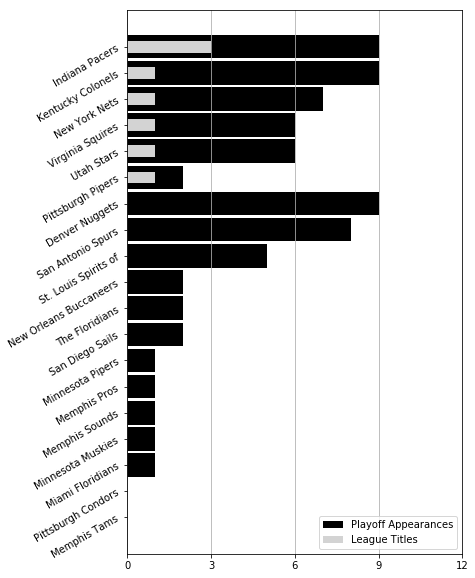

# franchise_history
WNBA and NBA franchise history visualization

## Description

This repo contains both a script (`franchise_history.py`) and notebooks (`franchise_history.ipynb` and `titles.ipynb`) using the `franchisehistory` endpoint of the [stats.nba.com](https://stats.nba.com). With the `League` and `Logo` classes from the `py_ball` package, the code here explores the history of active WNBA franchises and playoff/title history of all franchises.

## Results

### WNBA

The figures below show the history of active franchises in the WNBA and playoff/title history.

 

Note the rapid growth of lasting franchises in the early years of the league, along with the franchise changes (dashed, vertical lines) for the current Las Vegas Aces franchise.

The title visualization illustrates efficient playoff trips by the Comets and Lynx, along with a near ubiquitous presence in the postseason by the Liberty and Sparks.

### NBA

The figures below show the history of active franchises in the NBA and playoff/title history.

 

The NBA also features heavy, early growth, with other periods of league expansion throughout its history. Note the ABA-NBA merger that saw the Brooklyn Nets (then New York), San Antonio Spurs, Indiana Pacers, and Denver Nuggets join the NBA in 1976. 

The title chart shows the Lakers and Celtics dominance, along with the Denver Nuggets never making the NBA playoffs.

### ABA

The figure below shows the playoff/title history of ABA franchises.

The ABA featured a relative dynasty in the Indiana Pacers, while giving Nuggets fans a bit of positive history in the form of nine playoff appearances.
