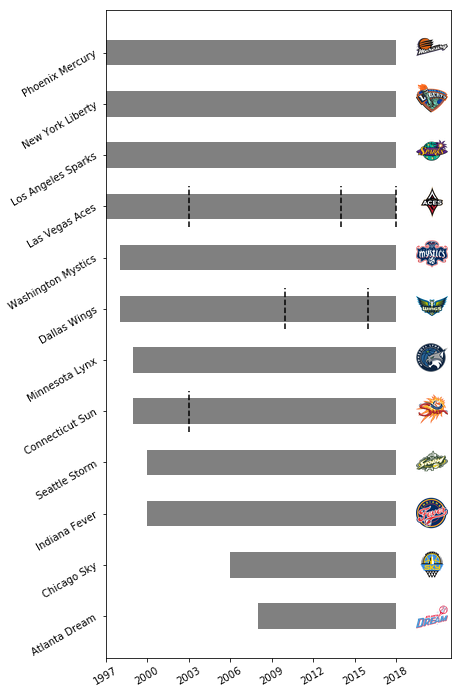
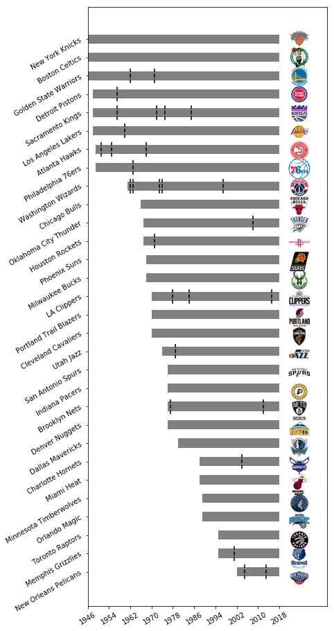

# franchise_history
WNBA and NBA franchise history visualization

## Description

This repo contains both a script (`franchise_history.py`) and notebook (`franchise_history.ipynb`) using the `franchisehistory` endpoint of the [stats.nba.com](https://stats.nba.com). With the `League` and `Logo` classes from the `py_ball` package, the code here explores the history of active WNBA franchises.

## Results

### WNBA

The figure below shows the history of active franchises in the WNBA.

### NBA

The figure below shows the history of active franchises in the NBA

