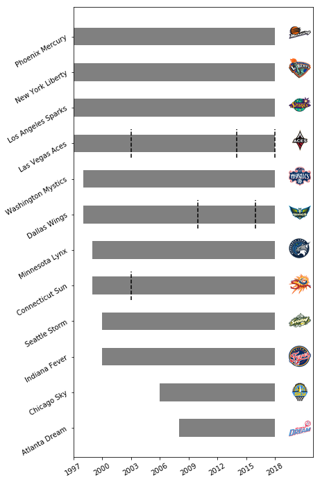
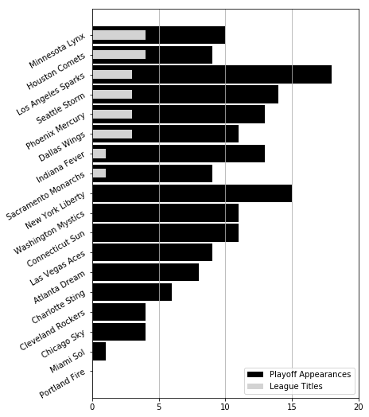
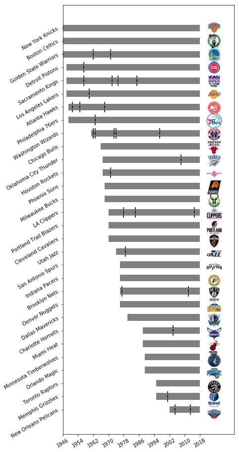
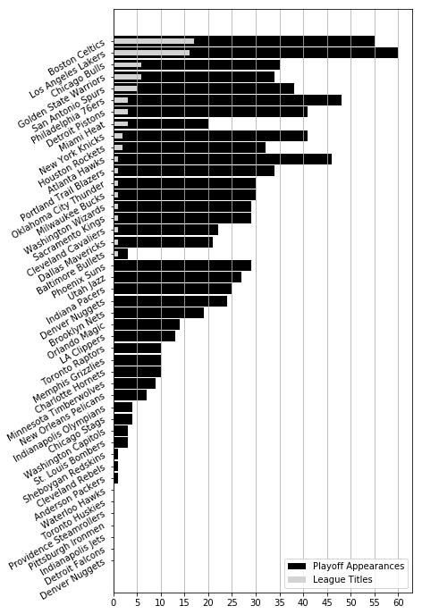

# franchise_history
WNBA and NBA franchise history visualization

## Description

This repo contains both a script (`franchise_history.py`) and notebook (`franchise_history.ipynb`) using the `franchisehistory` endpoint of the [stats.nba.com](https://stats.nba.com). With the `League` and `Logo` classes from the `py_ball` package, the code here explores the history of active WNBA franchises.

## Results

### WNBA

The figure below shows the history of active franchises in the WNBA.

 

Note the rapid growth of lasting franchises in the early years of the league, along with the franchise changes (dashed, vertical lines) for the current Las Vegas Aces franchise.

### NBA

The figure below shows the history of active franchises in the NBA

 

The NBA also features heavy, early growth, with other periods of league expansion throughout its history. Note the ABA-NBA merger that saw the Brooklyn Nets (then New York), San Antonio Spurs, Indiana Pacers, and Denver Nuggets join the NBA in 1976. 
